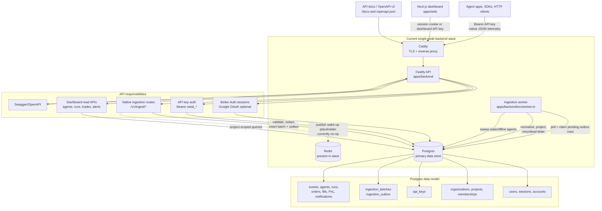
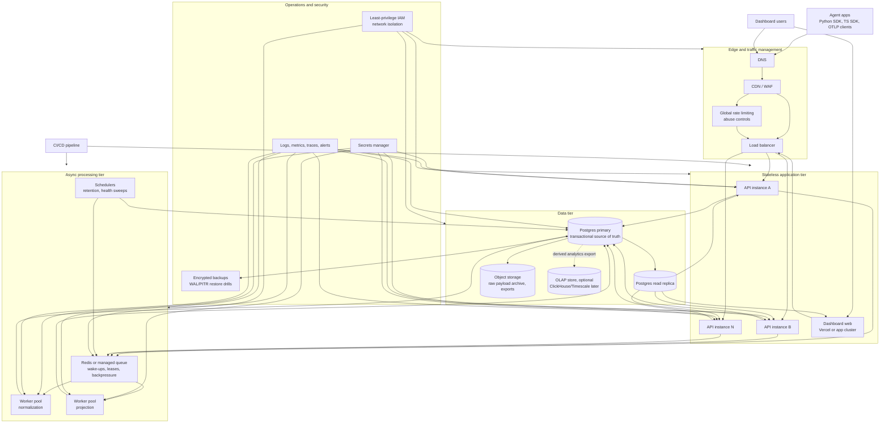

# OpenStat Backend System Architecture

This is a top-level view of the current backend architecture and a target
production-grade architecture. It intentionally stays above class/module detail
and focuses on traffic flow, storage, async processing, and operational
boundaries.

## Current Backend Top View

### Current Flow

1. Agents, SDKs, and HTTP clients send native JSON telemetry to the Fastify API.
2. API key auth resolves the organization and project scope.
3. The ingestion route validates, redacts, stores an `ingestion_batches` row,
   and writes one or more `ingestion_outbox` rows in Postgres.
4. Redis exists in the stack, but the current ingestion publisher is a no-op
   placeholder. The worker still polls Postgres deterministically.
5. The worker claims pending/retryable outbox rows, normalizes events, updates
   projections, records retries/dead letters, and sweeps agent health.
6. Dashboard read routes query projected tables for overview, agents, runs,
   trades, API keys, and notifications.

### Current Operational Shape

- Deployment target: one VPS for API, worker, Postgres, Redis, and Caddy.
- Source of truth: Postgres.
- Async boundary: Postgres outbox.
- Redis role today: installed dependency for future wake-ups/signaling, not the
  durable ingestion queue.
- Readiness check: API verifies Postgres with `select 1`.
- Logging: Docker `json-file` rotation in the Hetzner compose template.

## Future Production-Grade Top View

### Future Flow

1. SDKs and OTLP clients enter through DNS, WAF/CDN, load balancing, and global
   abuse controls.
2. API instances stay stateless and horizontally scalable.
3. Ingestion writes an accepted batch/outbox record to Postgres and publishes a
   real queue/wake-up signal.
4. Worker pools consume with backpressure, leases, retries, and dead-letter
   handling.
5. Postgres remains the transactional source of truth, with read replicas for
   dashboard-heavy queries.
6. Raw payload archives and exports move to object storage. High-volume
   analytics can later fan out into an OLAP store.
7. Observability, secrets, backups, restore drills, and network isolation become
   first-class production dependencies.

### Future Production Upgrades

- Replace the current Redis no-op publisher with real queue/wake-up behavior.
- Split API and workers into independently scalable services.
- Add load balancing, WAF/rate limiting, and autoscaling.
- Use private networking between app, queue, and database tiers.
- Add Postgres read replicas, encrypted backups, WAL/PITR, and restore drills.
- Add queue depth, worker lag, dead-letter, API latency, and database health
  alerts.
- Add retention jobs for raw telemetry and derived aggregates.
- Add an object-storage archive for large payloads, exports, and artifacts.
- Add an optional OLAP store only when Postgres projections stop being enough.
- Move secrets out of env files into a managed secret store.
- Add CI/CD deploy gates for lint, types, tests, migrations, and smoke checks.
